# ABAYA SABAYA

A premium abaya e-commerce website built for a Qatar-based luxury fashion brand serving GCC and international customers.

## Tech Stack

- **Framework**: Next.js 16 (App Router)
- **Styling**: Tailwind CSS 4
- **Animations**: Framer Motion
- **Language**: TypeScript
- **State Management**: React Context (Cart)

## Design System

| Element | Value |
|---------|-------|
| Primary Background | Cream `#FAF7F2` |
| Accent Gold | `#C5A467` |
| Rose Gold | `#B76E79` |
| Deep Black | `#0A0A0A` |
| Heading Font | Playfair Display |
| Body Font | Inter |
| Currency | QAR (Qatari Riyal) |

## Pages

- **Homepage** - Hero, collections, featured products, craftsmanship banner, testimonials, Instagram feed
- **Shop** - Filter sidebar (category, size, price, fabric), product grid, quick view modal
- **Product Detail** - Image gallery with zoom, size/color selection, care instructions, related products
- **About** - Brand story, mission, craftsmanship process, values, founder profile
- **Contact** - Contact form, WhatsApp integration, business hours, location
- **Cart/Checkout** - 3-step flow (cart, shipping, payment), promo codes, order summary

## Screenshots

### Homepage
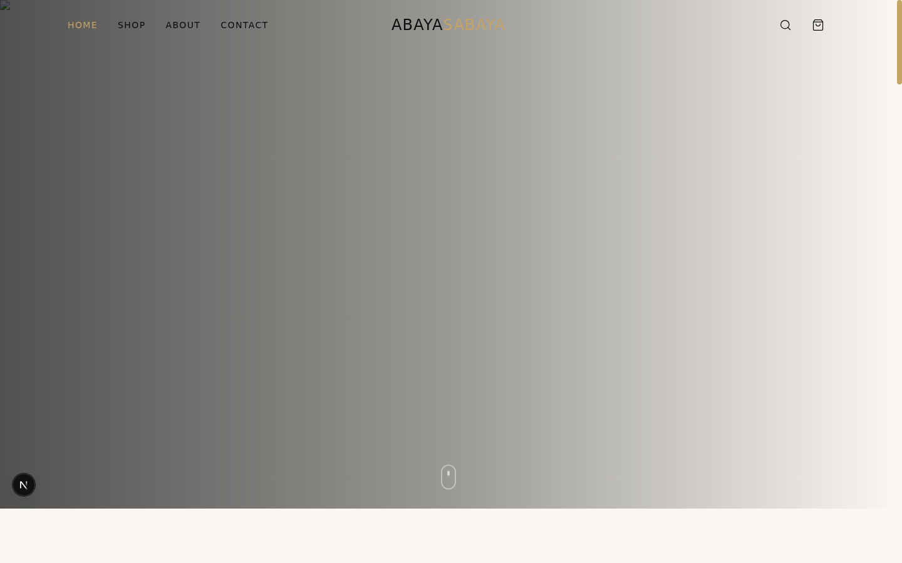

<details>
<summary>Homepage Mobile</summary>

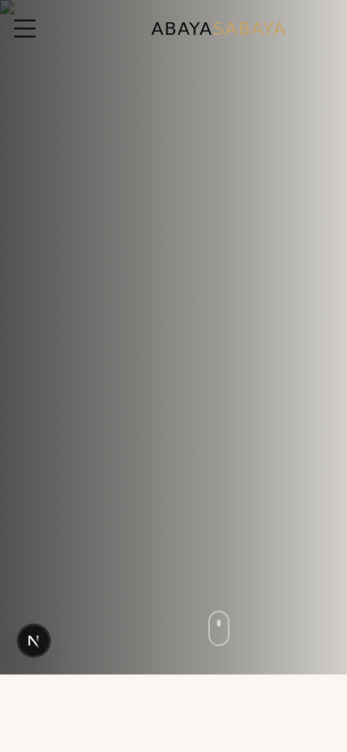
</details>

### Shop
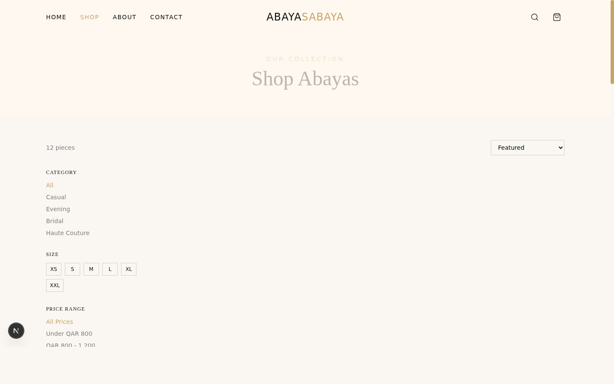

<details>
<summary>Shop Mobile</summary>

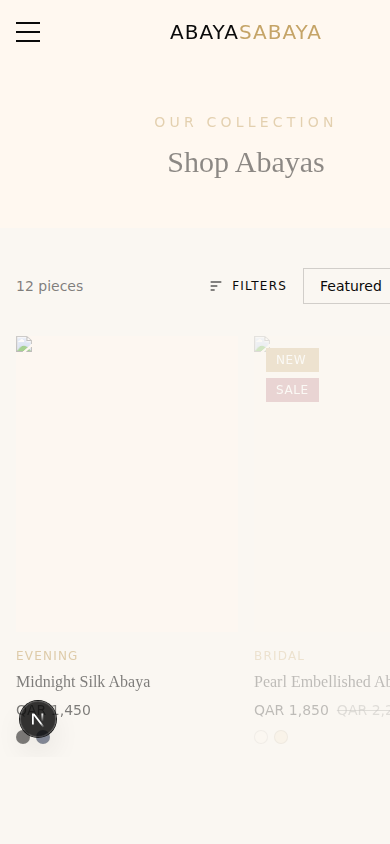
</details>

### Product Detail
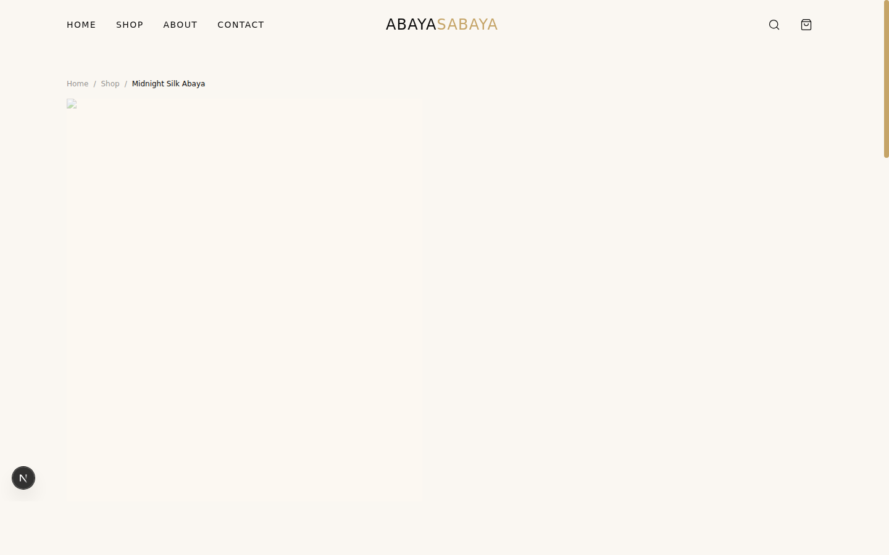

<details>
<summary>Product Detail Mobile</summary>

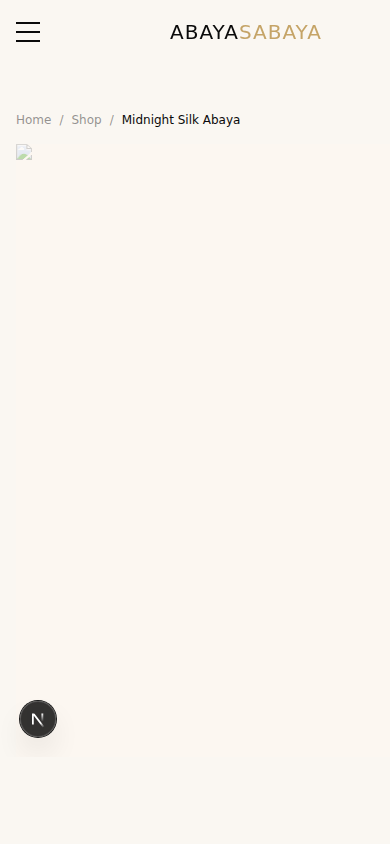
</details>

### About
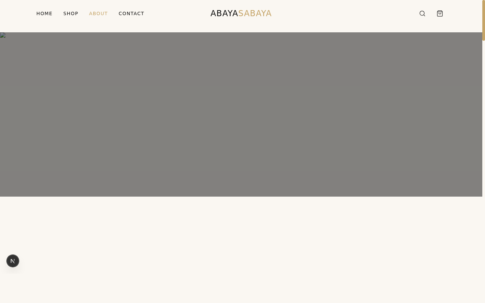

<details>
<summary>About Mobile</summary>

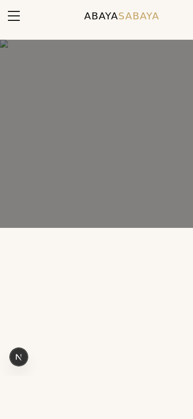
</details>

### Contact
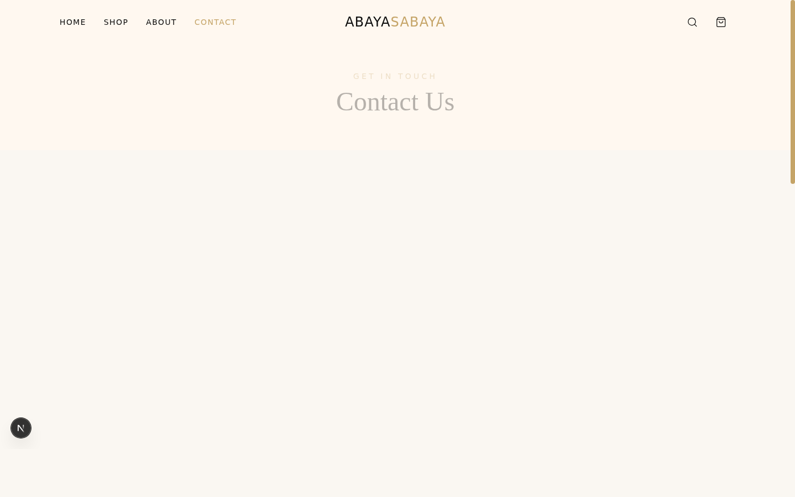

<details>
<summary>Contact Mobile</summary>

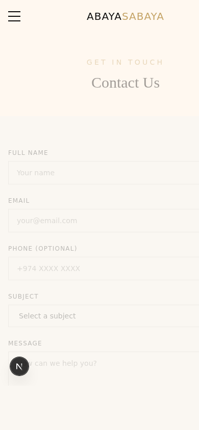
</details>

### Cart
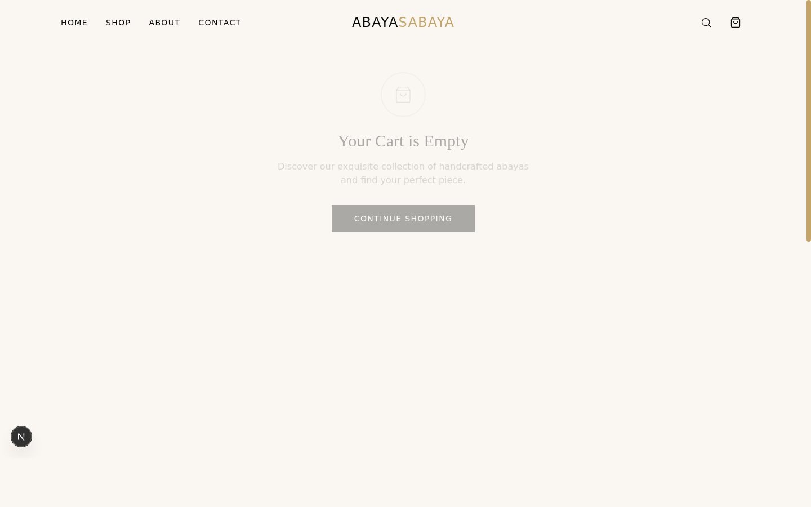

> **Note**: Screenshots were captured in a sandboxed environment. External images (Unsplash) and Google Fonts don't load, so the screenshots show layout structure with system fonts and placeholder backgrounds. When deployed, all images and fonts render correctly.

## Getting Started

```bash
npm install
npm run dev
```

Open [http://localhost:3000](http://localhost:3000) with your browser.

## Features

- Responsive design (mobile-first)
- Scroll-triggered animations with Framer Motion
- Cart with context-based state management
- Quick view modals for products
- Size guide with measurement chart
- 3-step checkout flow with promo code support (try `WELCOME10`)
- WhatsApp integration for customer support
- Newsletter signup
- Product filtering by category, size, price range, and fabric

## Deploy

Deploy on [Vercel](https://vercel.com) for the best Next.js experience:

```bash
npx vercel
```
